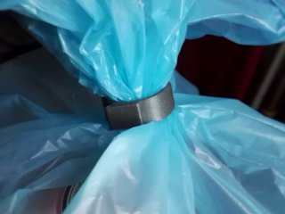

# Big Round Bag Clip
*3D printable round clip to seal large bags or tie things together (formerly thing:2037725)*

### License
[Creative Commons - Attribution - Non-Commercial](https://creativecommons.org/licenses/by-nc/4.0/)

### Attribution
This is a remix of MasterFX' Bag Clip - PLA compatible ([Thingiverse thing:330151](https://www.thingiverse.com/thing:330151)).

### Gallery

[🔎](images/photo1.jpg) [🔎](images/photo2.jpg)

## Description and Instructions

This is a print-in-place clip for sealing large bags like garbage bags, or any other large bag whose odor/humidity/dryness is best kept inside. The usual flat clips that bend around the bag may become difficult to use for large or thick bags, therefore this one is round and rigid, and relies on the flexibility of the bag itself. 
It can also be useful to hold cables or hoses together, or for any other application where a round clip comes in handy. Although the clip is easy to open and close, it can withstand quite a bit of force. An extra loop of tape can help to keep the clip secure.

It comes in several inner diameters:
- 24 mm (outer 33 mm),
- 28 mm (outer 37.5 mm),
- 32 mm (outer 42 mm),
- 38 mm (outer 49 mm).

If you need diameters in between these values or slightly above 38 mm, simply scale up the nearest smaller model in the XY plane by the appropriate factor (e.g. for 34 mm, scale up the 32 mm model by 34/32 or 106.25%). You may also be able to scale down from a larger model to a limited degree, depending on how accurate your printer is.

### Printing

The model is optimised to be printed at 0.2 mm layers.
For extra strength, print with 3 perimeters, which makes infill rather irrelevant (I used 15%).

Compared to MasterFX' original clip, I did reduce the tolerances of the hinge to make it less sloppy, so this may require a more accurately tuned printer.
Like the original, this should print fine without supports. There is not much space anyhow to place supports, so enabling them might only incur a risk of the hinge being jammed up.

PLA may not be the best material for this, because it tends to become brittle over time, making it more likely for the hook to break off. PETG is better suited for this.

### Post-printing

You may need to use a knife or screwdriver to pry the hinge loose if some strands of filament got inside it. Don't be afraid to use a bit of force, the hinge is quite sturdy.

## Updates

### 2017/01/14
First uploaded to Thingiverse.

### 2019/04/21
Added 28 mm and 38 mm models.

### 2022/08/13
Migrated to GitHub, provided Blender source, cleaned up models.

## Tags
`bag`, `bag_clip`, `clamp`, `clasp`, `clip`, `Garbage_bag_holder`, `hinge`, `Print-in-place`, `print_in_place`
